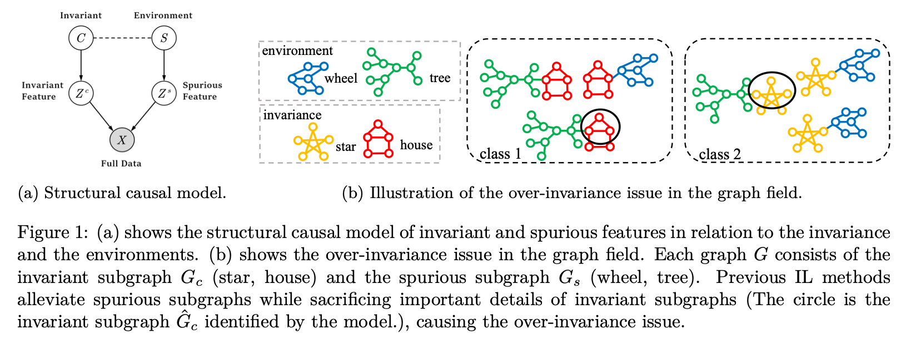

<h1 align="center">DivIL: Unveiling and Addressing Over-Invariance for Out-of- Distribution Generalization</h1>
<p align="center">
    <a href="https://arxiv.org/abs/2502.12413"></a>
    <a href="https://github.com/kokolerk/DivIL"></a>
    <a href="https://github.com/kokolerk/DivIL">  </a>
    <a href="https://github.com/kokolerk/DivIL/blob/main/LICENSE">  </a>
</p>

🚀🚀🚀 Official implementation of **DivIL: Unveiling and Addressing Over-Invariance for Out-of- Distribution Generalization**

## 💡 Highlights
<p align="center">
  
</p>

- We discover and theoretically define the **over-invariance** phenomenon, i.e., the loss of important details in invariance when alleviating the spurious features, which exists in almost all of the previous IL methods.
- We propose **Diverse Invariant Learning (DivIL)**, combining both invariant constraints and unsupervised contrastive learning with randomly masking mechanism to promote richer and more diverse invariance.
- Experiments conducted on **12 benchmarks, 4 different invariant learning methods** across **3 modali-ties (graphs, vision, and natural language)** demonstrate that DivIL effectively enhances the out-of-distribution generalization performance, verifying the over-invariance insight.

## 🛠️ Usage
We organize our code in the following strucute. The detailed guidance is included in the `README.md` of each subdirectory([Graph](https://github.com/kokolerk/DivIL/tree/main/Graph), [ColoredMNIST](https://github.com/kokolerk/DivIL/tree/main/ColoredMNIST) and [GPT2_nli](https://github.com/kokolerk/DivIL/tree/main/GPT2_nli)).


``` bash
DivIL/
├── README.md
├── Graph/
│   ├── README.md
│   └── datasets/
│   └── dataset_gen/
│   └── models/
│   └── main-batch_aug.py
│   └── ...
├── ColoredMNIST/
│   ├── README.md
│   ├── train_coloredmnist.py
│   └── ...
├── GPT2_nli/
│   ├── README.md
│   ├── main.py
│   └── ...
├── synthetic_data_experiment/
└── ...
```

## ✒️ Citation
This repo benefits from [CIGA](https://github.com/LFhase/CIGA) and [DomainBed](https://github.com/facebookresearch/DomainBed). Thanks for their wonderful works.

If you find our work helpful for your research, please consider giving a star ⭐ and citation 📝

```bibtex
@article{wang2025divil,
    title={Div{IL}: Unveiling and Addressing Over-Invariance for Out-of- Distribution Generalization},
    author={Jiaqi WANG and Yuhang Zhou and Zhixiong Zhang and Qiguang Chen and Yongqiang Chen and James Cheng},
    journal={Transactions on Machine Learning Research},
    issn={2835-8856},
    year={2025},
    url={https://openreview.net/forum?id=2Zan4ATYsh},
    note={}
}
```


